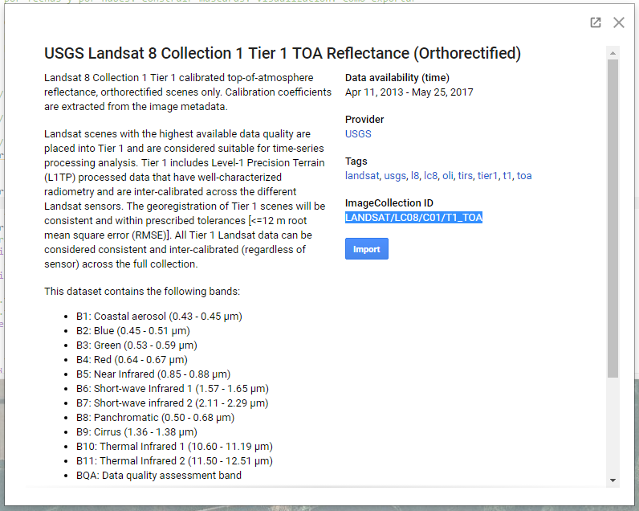
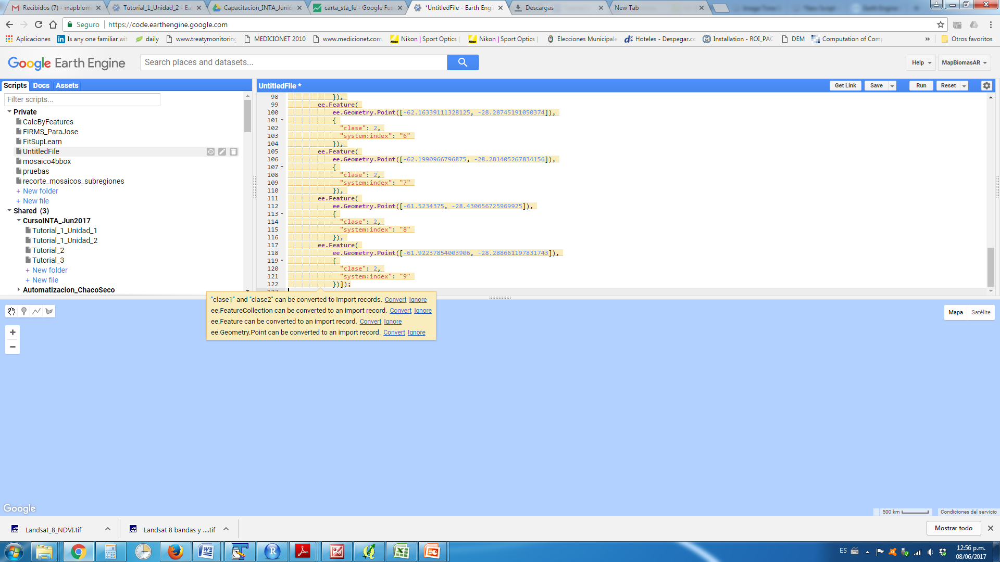

# Unidad 2: Manejo de datos rasters

Contenidos: Seleccionar colecciones, filtros por áreas, por fechas y por nubes. Construir máscaras. Visualización. Cómo exportar imágenes (ventajas y limitaciones del servicio). Funciones de agregación. Cálculos de índices. Generación de expresiones. Extracción de información a partir de features (agregación por medias, máximos, mínimos, etc.). Exportar como tabla de datos. Realizar gráficos.

## Trabajar con colecciones de imágenes

En la plataforma existe una gran cantidad de fuentes de información entre las que se incluye tanto información de base como imágenes satelitales, bases de datos meteorológicas, como productos generados: Modelos Digitales de Elevación (DEMs), Máscaras de cuerpos de agua y áreas urbanas, etc.

En este caso vamos a seleccionar un producto y lo vamos a filtrar (acotar) a las necesidades particulares (intervalo de tiempo y área de interés), ya que generalmente el alcance es global y se disponen largas series temporales.

Cada producto tiene un código asociado (ImageCollection ID) y una nomenclatura de bandas. El buscador del Code Editor permite ver las colecciones disponibles, el ID y las bandas, presenta una breve explicación del producto y el origen del mismo:



### Escoger una colección

Seleccionaremos una colección, en este caso: **LANDSAT/LC8\_L1T\_TOA**. El objeto que se utiliza para representar colecciones de imágenes es un [ee.ImageCollection](https://developers.google.com/earth-engine/api_docs#eeimagecollection).

```javascript
// Seleccionar producto. Indicar el ImageCollection ID
var producto = ee.ImageCollection('LANDSAT/LC8_L1T_TOA');
```

Cada elemento de la colección instanciada en la variable _producto_ es a su vez un objeto de tipo [ee.Image](https://developers.google.com/earth-engine/api_docs#eeimage).


### Filtrar las escenas de interés

A partir de la colección de imágenes instanciada vamos a aplicar diferentes filtros y selecciones.
Recordemos:
 - Los filtros aplican sobre metadatos, valores de la imagen o utilizando geometrías.
 - Las selecciones aplican sobre las bandas.

Comenzamos definiendo un área de estudio a partir de un vector para luego poder filtrar por región.

 ```javascript
 // área de estudio (de sección anterior)
 var geometry = ee.FeatureCollection('ft:1NOdzgdcCiWZ6YcoEharXG_IYmW03G-ZJeUSZtoOB');
 ```

Ahora vamos a aplicar varios filtros, sigamos el script:

```javascript

// Filtrar colección
var producto_filtrado = producto
    // Por área de estudio. Debe estar cargada el área
    // en este caso en la variable “geometry”
    .filterBounds( geometry )

    //por rango de fechas
    .filterDate('2016-08-01', '2016-10-31')

    // por cobertura de nubes máxima
    .filterMetadata('CLOUD_COVER','less_than', 40);

```

En la consola se pueden ver los detalles de la colección filtrada o seleccionada. Para ello hay que invocar a la función **print()** desde el Code Editor:

```javascript
// ver detalles de colección y filtros aplicados
print("Coleccion seleccionada", producto_filtrado);
```

Existen otras opciones de filtrado, en el caso de utilizar colecciones LANDSAT podemos utilizar path/row.

```javascript
producto_filtrado = producto_filtrado     // por Path y Row
    .filter(ee.Filter.eq('WRS_PATH', 227))
    .filter(ee.Filter.eq('WRS_ROW', 79));
```

Veamos cómo seleccionar ([.select()](https://developers.google.com/earth-engine/api_docs#eeimagecollectionselect)) las bandas de interés.

```javascript
// Definir bandas a seleccionar
var bandas = ['B2','B3','B4','B5','B6','B7']
producto_filtrado = producto_filtrado.select(bandas);
```

Dado que una colección (objeto [ee.ImageCollection](https://developers.google.com/earth-engine/api_docs#eeimagecollection)) implica un catálogo, un grupo de imágenes. Para poder generar nuevas bandas, o exportar se requiere convertirla al objeto [ee.Image](https://developers.google.com/earth-engine/api_docs#eeimage). Esto se puede hacer creando una imagen a partir de bandas de la colección o aplicando algoritmos de reducción a la colección (e.g:mediana, promedio o valor máximo de pixels). En este caso, vamos a obtener como resultado una única imágen para cada banda (ahora objeto ee.Image), la cual puede ser posteriormente exportada y permite generar índices a partir de sus bandas.


```javascript
// Aplicar reducción de mediana
var stack1 = producto_filtrado.median();
```

Podemos visualizar la imagen identificando las bandas a mostrar (orden R,G,B), seleccionar los valores máximos y mínimos para ecualizar cada banda y una descripción de la capa. Mover el visor hacia el área de estudio para ver la imagen.


```javascript
// ver imagen en mapa:
Map.addLayer( stack1, {bands: ['B5', 'B4', 'B3'], min: [0,0,0], max:[1,1,1] } , "Landsat 8 B5-B4-B3" );

// centrar en area de estudio - indicar nivel de zoom
Map.centerObject( geometry, 8 );
```

## Generación de índices

Existen varias formas de generación de índices a partir de bandas:

1.  Por medio de una expresión
2.  Utilizando las funciones básicas de operadores matemáticos aplicados sobre la imagen.
3.  Por medio de una función


### Expresiones

Consideramos que la más sencilla es por medio de una expresión. Lo que requiere primero definir un diccionario (ver detalles en [Earth Engine Objects](https://developers.google.com/earth-engine/tutorial_js_02)) indicando las bandas que se van a utilizar para generar el índice.


```javascript
// Generación de Diccionario
var bandas_indices = {
    'NIR': stack1.select('B5'),
    'RED': stack1.select('B4')
};
```

Luego se indica la ecuación y el diccionario de bandas a utilizar:


```javascript
// cálculo del NDVI usando una expresión
var ndvi = stack1.expression('(NIR - RED) / (NIR + RED)', bandas_indices).rename('NDVI');

// ver imagen en mapa:
Map.addLayer(ndvi, { min: [-1], max: [1] }, "NDVI 1" );
```

​
### Realizar operaciones directamente sobre la imagen


```javascript
// cálculo NDVI - operaciones sobre la imagen
var ndvi2 = stack1.select('B5').subtract(stack1.select('B4'))
    .divide(stack1.select('B5').add(stack1.select('B4')));

// ver imagen en mapa:
Map.addLayer(ndvi2, { min: [-1], max: [1] }, "NDVI 2" );
```

### Funciones definidas en la API

En este caso se usa una función de normalización disponible en la plataforma ([normalizedDifference](https://developers.google.com/earth-engine/api_docs#eeimagenormalizeddifference)), indicando las bandas a normalizar:


```javascript
// cálculo NDVI - Por medio de una función
var ndvi3 = stack1.normalizedDifference(['B5', 'B4']);

// ver imagen en mapa:
Map.addLayer (ndvi3, { min: [-1], max: [1] }, "NDVI 3" );
```

Agregar índice generado al stack. Se recomienda darle un nombre a la nueva banda con la función [rename](https://developers.google.com/earth-engine/api_docs#eeimagerename):


```javascript
// agregar bandas de indices
imagen1 = imagen1.addBands(ndvi.rename('NDVI'));

// ver imagen en mapa:
Map.addLayer (stack1, {bands: ['NDVI'], min: [-1], max: [1] }, "NDVI" );
```

**Desafío:**
  1. ¿Qué método de los visto para calcular índices considera adecuado implementar este índice?
```
GVI = -0.2941*Banda2 - 0.243 * Banda3 -0.5424 * Banda4 + 0.7276 * Banda5 + 0.0713 * Banda6 - 0.1608 * Banda7
```
  2. Impleméntelo y agréguelo al mapa.

## Visualización de imágenes en mapa

Se puede asignar una escala de colores para bandas únicas (e.g. NDVI) a través de dos métodos:

### Utilizando paletas de colores

La definición de paletas de colores requiere asignar un rango de colores en formato hexadecimal RGB (como vimos en el [picker color](https://www.google.com.ar/#q=picker+color)).


```javascript
// Paleta de colores
Map.addLayer(ndvi3, {min:0, max:0.7 ,palette: ['339820', 'e6f0c2']},"NDVI 3 con Paleta");
```

### Utilizando un SLD

Podemos utilizar un *Style Layer Description* ([SLD](http://www.opengeospatial.org/standards/sld)) para crear una paleta de colores. La misma puede ser generada a mano o con alguna otra imagen desde QGIS u otra herramienta que guarde estilos SLD.

```javascript
// Generar estilo con SLD

var sld_intervals =
  '<RasterSymbolizer>' +
    '<ColorMap  type="intervals" extended="false" >' +
      '<ColorMapEntry color="#0000ff" quantity="0" label="0"/>' +
      '<ColorMapEntry color="#00ff00" quantity="0.1" label="0 - 0.1" />' +
      '<ColorMapEntry color="#007f30" quantity="0.2" label="0.1 - 0.2" />' +
      '<ColorMapEntry color="#30b855" quantity="0.3" label="0.2 - 0.3" />' +
      '<ColorMapEntry color="#ff0000" quantity="0.4" label="0.3 - 0.4" />' +
      '<ColorMapEntry color="#ffff00" quantity="1.0" label="0.4 - 1.0" />' +
    '</ColorMap>' +
  '</RasterSymbolizer>';

Map.addLayer (ndvi3.sldStyle(sld_intervals), {}, "NDVI 3 con SLD" );

```

## Exportar imágenes

Permite guardar imágenes o tablas en una carpeta de Google Drive.

Se pueden seleccionar bandas para exportar o exportar todas las bandas.

Puede convenir cambiar el formato de los valores para que ocupe menos espacio. En este caso dado que contiene valores entre -1 y 1 en formato de 4 Bytes por pixel (números con decimales), lo vamos a convertir a número entero (2 bytes por píxel) con un factor de conversión de 10000.

```javascript
// Seleccionamos una sola banda (NDVI) para guardar.
// Cambio de escala (x10.000) y Convierto a entero para que ocupe menos espacio

var stack2 = stack1.select('NDVI').multiply(10000).uint16()
```

Finalmente se debe definir además de la imágen a exportar, el tamaño de píxel (scale), una FeatureCollection con el área de estudio (region) y el tamaño máximo de pixeles que puede contener la imagen (maxPixels):


```javascript
// exportar imágen a Google Drive
Export.image.toDrive({
  image:stack2,
  description: 'Landsat_8_NDVI',
  scale: 30,
  region: geometry,
  maxPixels: 1e12
});
```

## Extracción de información

Earth engine permite extraer rápidamente información de las imágenes seleccionadas, exportarla o analizarla desde la plataforma a través de sus herramientas de gráficos.

En este caso vamos a extraer información correspondiente a los puntos generados o disponibles previamente (Tutorial 1 Unidad 1). En caso de haber generado los puntos o polígonos desde el visualizador de GEE en otro código, se puede copiar el código de la sección “imports”, haciendo click en “show generated code” y pegándola en un nuevo código:


Código generado previamente:

```javascript
var clase0 = ee.FeatureCollection(
    [ee.Feature( ee.Geometry.Point([-61.69303894042969, -28.33279078149813]), {"clase": 0,"system:index": "0"}),
    ee.Feature( ee.Geometry.Point([-62.17506408691406, -28.375693762957862]), {"clase": 0,"system:index": "1"}),
    ee.Feature( ee.Geometry.Point([-62.31170654296875, -28.40529274756662]), {"clase": 0,"system:index": "2"}),
    ee.Feature( ee.Geometry.Point([-62.15240478515625, -28.4451476995102]), {"clase": 0,"system:index": "3"}),
    ee.Feature( ee.Geometry.Point([-62.02537536621094, -28.463862268869118]), {"clase": 0,"system:index": "4"}),
    ee.Feature( ee.Geometry.Point([-61.820068359375, -28.46688043752887]), {"clase": 0,"system:index": "5"}),
    ee.Feature( ee.Geometry.Point([-61.82487487792969, -28.47774513090882]), {"clase": 0,"system:index": "6"}),
    ee.Feature( ee.Geometry.Point([-61.80015563964844, -28.46989851998662]), {"clase": 0,"system:index": "7"}),
    ee.Feature( ee.Geometry.Point([-61.73561096191406, -28.461447671879828]), {"clase": 0,"system:index": "8"}),
    ee.Feature( ee.Geometry.Point([-62.307586669921875, -28.34487788226893]), {"clase": 0,"system:index": "9" })]);

var clase1 = ee.FeatureCollection(
    [ee.Feature( ee.Geometry.Point([-62.36457824707031, -28.355150836534136]),{"clase": 1,"system:index": "0"}),
    ee.Feature( ee.Geometry.Point([-62.33848571777344, -28.349712337487777]),{"clase": 1,"system:index": "1"}),
    ee.Feature( ee.Geometry.Point([-61.98829650878906, -28.25177175656493]),{"clase": 1,"system:index": "2"}),
    ee.Feature( ee.Geometry.Point([-61.95808410644531, -28.249352330644772]),{"clase": 1,"system:index": "3"}),
    ee.Feature( ee.Geometry.Point([-61.37306213378906, -28.30921698045776]),{"clase": 1,"system:index": "4"}),
    ee.Feature( ee.Geometry.Point([-61.96495056152344, -28.298335001920627]),{"clase": 1,"system:index": "5"}),
    ee.Feature( ee.Geometry.Point([-62.16339111328125, -28.28745191050374]),{"clase": 1,"system:index": "6"}),
    ee.Feature( ee.Geometry.Point([-62.1990966796875, -28.281405267834156]),{"clase": 1,"system:index": "7"}),
    ee.Feature( ee.Geometry.Point([-61.5234375, -28.430656725969925]),{"clase": 1,"system:index": "8"}),
    ee.Feature( ee.Geometry.Point([-61.92237854003906, -28.288661197831743]),{"clase": 1,"system:index": "9"})]);

```

Esto generará FeatureCollections con información de los puntos que son cargadas en el código al inicio.

Al pegar esta sección de código y apoyar el mouse sobre este, preguntará si queremos convertir a registros importados, a lo que le indicamos “Convert”. De esta manera ubica el código de los puntos agregados en una sección diferente (al inicio, en *imports*):



Se deben unificar las distintas clases generadas en un único FeatureCollection llamado “samples”:


```javascript
// Extracción de información
// Unir muestras por clase en un único FeatureCollection    

var samples = clase0;

samples = samples.merge(clase1);

// ver caracteristicas de FeatureCollection
print ("muestras",samples);
```

Para extraer información hay que indicar la imágen a utilizar (“stack1), los atributos del vector (FeatureCollection) que se desean mantener (atributo “clase”) y la escala (resolución de la imagen):

```javascript
// extraer información:
var training = stack1.sampleRegions({
  collection: samples,
  properties: ['clase',],
  scale: 30
});
```

La información obtenida puede ser exportada como CSV:


```javascript
// exportar tabla con información
Export.table.toDrive({
    'collection': training,
    'description': 'muestras_tutorial_1_2',
    'fileNamePrefix': 'muestras_tutorial_1_2',
    'fileFormat': 'CSV'}
);
```

Análisis de información Extraída. La información extraída en formato CSV puede ser analizada por supuesto en otras herramientas: Excel, R, etc. En este caso vamos a generar algunos gráficos desde Earth Engine para hacer un análisis preliminar de la información.


## Gráficos

Desde la API [ui.Chart](https://developers.google.com/earth-engine/charts) podemos generar algunos gráficos a partir de datos extraídos desde las imágenes.
A continuación se muestra cómo generar un gráfico de tipo XY (“ScatterChart”). Se debe indicar en la función [ui.Chart.feature.groups](https://developers.google.com/earth-engine/charts_feature_groups) el set de datos (“training”), las bandas a graficar (primero la banda que va a eje de las X (“B5”) y luego la banda que va al eje de las Y (“B4”) un atributo de agrupamiento (“clase”). Se pueden modificar todos los parámetros del gráfico como: el texto de los ejes y la leyenda.

```javascript
// Generar Grafico XY. indicar set de datos, banda en eje X, banda en eje Y y grupo

var chart = ui.Chart.feature.groups(training, 'B5', 'B4', 'clase')
      .setChartType('ScatterChart')
      .setOptions({
        hAxis: {title: 'B5'},
        vAxis: {title: 'B4'},
      }).setSeriesNames(["clase 0", "clase 1"]);

// Mostrar el gráfico generado
print(chart);
```

**Desafío:** Seleccione otras bandas para agregar en el gráfico y analizar, identifique que bandas tienen mayor separabilidad

Bibliografía
============

- Baig, M. H. A., Zhang, L., Shuai, T., & Tong, Q. (2014). Derivation of a tasselled cap transformation based on Landsat 8 at-satellite reflectance. Remote Sensing Letters, 5(5), 423-431.
