# Unidad 1: Manejo de datos vectoriales

Unidad 1: Manejo de datos vectoriales: Manejo de geometrías y generación de features. Creación y administración de colecciones de features. Carga y visualización de vectores utilizando Google Fusion Table (FT). Manejo de  iteraciones sobre colecciones de features. Exportar como tabla de datos. Realizar gráficos.

## Manejo de geometrías y generación de features

Earth Engine maneja datos vectoriales con el tipo Geometry. La especificación [GeoJSON](https://tools.ietf.org/html/rfc7946) describe en detalle el tipo de geometrías soportadas por Earth Engine, incluyendo:

-   Point: una lista de coordenadas en alguna proyección,
-   LineString: una lista de puntos,
-   LinearRing: una LineString cerrada
-   Polygon: una lista de LinearRings donde la primera es una cáscara y
    los anillos subsiguientes son agujeros.

Earth Engine también soporta MultiPoint, MultiLineString y MultiPolygon. GeoJSON GeometryCollection también es compatible, aunque tiene el nombre MultiGeometry dentro de Earth Engine.

### Creación de Geometrías

Vamos a crear y mapear una geometría

    var point = ee.Geometry.Point([-60.54, -31.85]);

[ee.Geometry.Point](https://developers.google.com/earth-engine/api_docs%23eegeometrypoint) es la llamada a la API Earth Engine que recibe dos parámetros una lista
**ee.List([])** y el segundo que es opcional una proyección que puede ser especificada como código EPSG [[1]](#ftnt1). El valor predeterminado es EPSG:4326 (WGS84 Lat/Lon)

La definición de esa geometría (según la definición [GeoJSON](https://tools.ietf.org/html/rfc7946))
sería:

    {
      "geodesic": true, // WGS84 Lat/Lon 
      "type": "Point",
      "coordinates": [
        -60.54,
        -31.85
      ]
    }

De esa forma los datos son almacenados y utilizados internamente por la librería. Para poder ver en el Code Editor el formato nativo podemos hacer **print(point);** y luego en la consola hacer clic en JSON.

También podemos agregar la geometría en el mapa utilizando la siguiente
instrucción:

    Map.addLayer(point,{'color':'00FF11'} ,'Punto');

**Tips**: Si quiere modificar el color de la geometría el formato hexadecimal de colores html puede obtenerse desde Google realizando la búsqueda con [picker color](https://www.google.com.ar/%23q%3Dpicker%2Bcolor&sa=D&ust=1500416741579000&usg=AFQjCNGfn3HNPcS6_E7RO22TMfyDv4JJAQ).

El resto de las geometrías se construyen de la misma forma, veamos:

-   Líneas

    var lineString = ee.Geometry.LineString([[-63, -36], [-60.54, -31.85], [-58, -28], [-63, -27]]);

[ee.Geometry.LineString](https://developers.google.com/earth-engine/api_docs%23eegeometrylinestring) recibe una lista de puntos y parámetros opcionales.

Agregue la geometría al mapa:

    Map.addLayer(lineString,{'color':'CC0011'} ,'Linea');

Podemos centrar el mapa en una geometría o feature particular, eso lo podemos hacer con Map.centerObject así:

    Map.centerObject(lineString, 7);

-   Anillo de línea

    var linearRing = ee.Geometry.LinearRing(
    [[-63, -36.09],[-59.54,-31.85],
    [-58, -28], [-63, -25],
    [-64, -27],[-63, -36]]);

[ee.Geometry.LinearRing](https://developers.google.com/earth-engine/api_docs%23eegeometrylinearring) recibe una lista de puntos que a diferencia de LineString comienza y termina con el mismo punto para poder cerrar el anillo. También tiene parámetros opcionales.

Y si, al mapa!!

    Map.addLayer(linearRing,{'color':'b227b0'} ,'Anillo');

-   Rectángulo

    var rectangle = ee.Geometry.Rectangle([-62,-33, -59,-31]);

[ee.Geometry.Rectangle](https://developers.google.com/earth-engine/api_docs%23eegeometryrectangle) recibe una lista con esquinas mínimas y máximas del rectángulo, como una lista de dos puntos en formato de coordenadas GeoJSON 'Point' o una lista de dos ee.Geometry que describen un punto, o una lista de cuatro números en el orden __xMin, yMin , xMax, yMax__.

A mapear!!

    Map.addLayer(rectangle,{'color':'fbff23'} ,'Rectángulo');

-   Polígono

    var polygon = ee.Geometry.Polygon(
    [[[-62.935, -34.415],
    [-61.745, -34.411],
    [-61.388, -34.068],
    [-62.663, -34.075]]]);

[ee.Geometry.Polygon](https://developers.google.com/earth-engine/api_docs%23eegeometrypolygon) recibe una lista de anillos que definen los límites del polígono. Puede ser una lista de coordenadas en el formato 'Polygon' de GeoJSON, o una lista de ee.Geometry que describe un LinearRing. El resto de los parámetros son similares al resto de las geometrías.

    Map.addLayer(polygon, {'color':'16a322'} ,'Polígono');

-   Geometrías Multiparte: Una geometría individual puede consistir en múltiples geometrías. Para dividir una Geometría de varias partes en sus geometrías constitutivas, use **geometry.geometries()**. Ejemplo:

    var multiPoint = ee.Geometry.MultiPoint(
                  [[-62.319,-32.856],
                  [-62.528,-32.944],
                  [-62.418,-33.109],
                  [-62.193,-33.008],
                  [-62.166,-32.805]]);
    Map.addLayer(multiPoint, {'color':'16a322'} ,'multiPoint');

Vamos a imprimir los puntos de  la geometría, así que al objeto multiPoint le vamos a pedir todas las geometrías que lo componen.

    var las_geometrias = multiPoint.geometries();
    print(las_geometrias);

1.  ¿Qué tipo de dato es la variable **las\_geometrias**?
2.  ¿Cómo puedo recuperar una de las geometrías contenidas en
    **las\_geometrias**? lista.get(id)

**Desafío 1:** Convierta los puntos existentes en multiPoint a un LinearRing.

## Crear Geometrías desde el mapa

Existe una forma muy práctica de dibujar Geometrías desde el mismo mapa del Code Editor.

Veamos un ejemplo:

| Las opciones para dibujar están ubicadas en el sector superior izquierdo del mapa. Las herramientas disponibles permiten activar el dibujado de geometrías múltiples de: puntos, líneas y polígonos. Para dejar de dibujar se hace clic en la mano de la izquierda. | 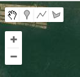 |

| Una vez que se activa la herramienta |  |
| esta se habilita para poder dibujar. |                                 |
| Se asigna un color al azar y cada    |                                      |
| figura que se trace formará parte de |                                      |
| una geometría múltiple.              |                                      |

| Es posible incorporar desde la       | 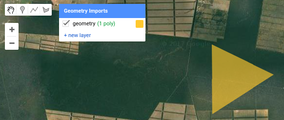 |
| sección de Geometry Imports una      |                                  |
| nueva capa que se instancia como una |                                      |
| nueva variable de la clase           |                                      |
| Geometry.XXXX.                       |                                      |

| Las capas de geometrías que se van   | 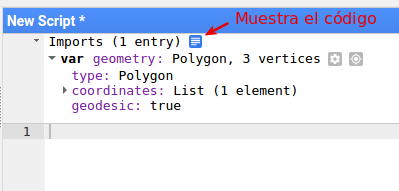               |
| incorporando serán ubicadas en la    |                                      |
| sección de Imports del editor de     |                                      |
| código fuente.                       |                                      |
|                                      |                                      |
| Estos objetos son mostrados de       |                                      |
| manera formateada. Pero haciendo     |                                      |
| clic en el ícono azul se muestra el  |                                      |
| código fuente correspondiente para   |                                      |
| la creación de la geometría.         |                                      |

| El código fuente generado puede      | 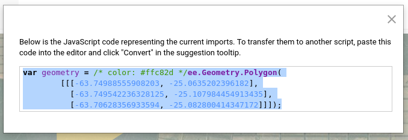|
| copiarse y pegarse en el script que  |                                 |
| se está escribiendo.                 |                                      |
|                                      |                                      |
| Ojo: En algunos Navegadores no copia |                                      |
| (Firefox 49.0.2, por ejemplo.)       |                                      |

## Geometrías Geodésicas y planas

Una geometría creada en Earth Engine es geodésica (es decir, los bordes son la trayectoria más corta en la superficie de una esfera) o planar (es decir, los bordes son el camino más corto en un plano cartesiano bidimensional).

En la configuración predeterminada de la instanciación de un objeto ee.Geometry.XXXXX este se crea como EPSG:4326, es decir, será una geometría geodésica.

    var PoligonoGeo = ee.Geometry.Polygon([
    [
        [-71.411,-39.470], [-57.128,-39.402],
        [-57.304,-33.394], [-70.751,-33.358],
        [-71.411,-39.470]] 
    ]);

Esa misma geometría puede ser expresada en el plano, ya sea cuando se crea o puede ser convertida:

    var PoligonoPlano = ee.Geometry(PoligonoGeo, null, false);

Veámos cómo se ven estas geometrías en el mapa:

Map.centerObject(PoligonoGeo);

Map.addLayer(PoligonoGeo, {color: 'FF0000'}, 'Geodésico');

Map.addLayer(PoligonoPlano, {color: '000000'}, 'Plano');

Operaciones con Geometrías {#h.e860ppwtnt27 .c48 .c59}
--------------------------

Earth Engine admite una amplia variedad de operaciones en objetos
Geometry. Estos incluyen operaciones en geometrías individuales tales
como calcular un buffer, centroide, bounding box, perímetro, envolvente
convexa, etc.

Utilizando la definición del polígono de la anterior vamos a realizar
algunas operaciones de geometrías:

-   Cálculo de área en KM²

print('Área: ', poligono.area().divide(1000 \* 1000));

        Todos los valores de mediciones de distancias vienen expresados
en metros.

-   Longitud de perímetro en KM

print('Perímetro: ', poligono.perimeter().divide(1000));

-   Mostrar el GeoJSON 'type'.

print('Geometry type: ', poligono.type());

-   Mostrar la lista de coordenadas.

          print('Coordenadas: ', poligono.coordinates());

-   Muestra true/false si las coordenadas son o no geodésicas.

print('¿Está en coordenadas geodésicas? ', poligono.geodesic());

-   Muestra el BBOX de una geometría

print('Bounding Box', poligono.bounds());

bounds retorna el rectángulo que envuelve a la geometría en una
geometría plana.

-   Calcular el buffer de un polígono

          var buffer = poligono.buffer(5000);

        La distancia del buffer está expresada en metros.

-   Calcular el centroide de un polígono..

          var centroid = poligono.centroid();

 

Ahora podemos mapear algunas de estas operaciones:

Map.addLayer(buffer, {'color':'0be51e'}, 'buffer');

Map.addLayer(poligono, {}, 'el polígono');

Map.addLayer(centroid, {'color':'e5280b'}, 'centroide');

Map.centerObject(buffer, 7);

 

Las  operaciones que hemos realizado han sido todas con operadores
unarios, donde a la geometría le pedimos (o le calculamos) algo. Ahora
vamos a probar algunos operadores entre geometrías.

Comenzamos con dos geometrías de polígono que las he creado desde el
mapa como se mostró previamente.

var poli1 = ee.Geometry.Polygon(

          [[[-63.62113952636719, -25.129433436071757],

            [-63.572044372558594, -25.128811779454853],

            [-63.57135772705078, -25.054501051619468],

            [-63.622169494628906, -25.05512308589585]]]);

               

var poli2 = ee.Geometry.Polygon(

          [[[-63.645172119140625, -25.061965254565465],

            [-63.65753173828125, -25.13005508952488],

            [-63.59367370605469, -25.128811779454853],

            [-63.59367370605469, -25.061343255018567]]]);

Calculamos la unión de las dos geometrías. Donde el primer parámetro es
la geometría que se quiere unir y el segundo es un margen de error.
ErrorMargin es la cantidad máxima de error tolerada al realizar
cualquier reproyección necesaria, el valor está expresado en metros.

var poli1Upoli2 = poli1.union(poli2, ee.ErrorMargin(1));

Map.addLayer(poli1Upoli2, {color: 'FF00FF'}, 'Unión');        

// Centramos el mapa en la unión

Map.centerObject(poli1Upoli2, 12);

 

Calculamos la intersección de los dos polígonos con la
función intersection que

var intersection = poli1.intersection(poli2, ee.ErrorMargin(1));

Map.addLayer(intersection, {color: '00FF00'}, 'Intersección');

 

Calculamos la diferencia entre el polígono 1 y el polígono 2. Es el área
de la primer geometría que no comparte con la segunda.

var diff1 = poli1.difference(poli2, ee.ErrorMargin(1));

Map.addLayer(diff1, {color: 'FFFF00'}, 'Diferencia( P1 - P2)');

Calculamos la diferencia simétrica, esta se define como el área de la
geometría A y el área de la geometría B excepción el área común a ambas.

var dif\_sim = poli1.symmetricDifference(

poli2,

ee.ErrorMargin(1));

Map.addLayer(dif\_sim, {color: '000000'}, 'Diferencia Simétrica');

 

Mapeamos las dos geometrías con las que hicimos los ejemplos.

Map.addLayer(poli1, {color: 'FF0000'}, 'Polígono 1');

Map.addLayer(poli2, {color: '0000FF'}, 'Polígono 2');

### Desafío 2: {#h.2n3vz432laxa .c57}

Verifique si una de las rectas que pasan por los puntos [-63.635,
-25.051] y [-63.617, -25.146] intersecta la intersección (valga la
redundancia) de las geometrías utilizadas previamente (poli1 y poli2).

### Desafío 3: {#h.35dab22g0dqa .c57}

Ahora compruebe si el punto definido abajo está contenido en la
geometría que resultó de la diferencia simétrica.

var punto = ee.Geometry.Point([-63.6084366, -25.0803128]);

Creación de Features {#h.bta4hzrzki33 .c48}
--------------------

Un Feature de Earth Engine se define como un GeoJSON Feature. En pocas
palabras, es un objeto con una propiedad de tipo Geometry y una
propiedad de properties que almacena un diccionario de otras
propiedades.

Entonces, necesitamos un objeto Geometry y opcionalmente un diccionario
con los atributos de ese Feature.

// La geometría

var poligono = ee.Geometry.Polygon(\
        [[[-63.33892822265625, -25.150878651548442],\
          [-63.33824157714844, -25.17791290009134],\
          [-63.31043243408203, -25.17760219565173],\
          [-63.31043243408203, -25.15025710411473]]]);

La declaración del Feature:

var miFeature =
[ee.Feature](https://developers.google.com/earth-engine/api_docs%23eefeature&sa=D&ust=1500416741607000&usg=AFQjCNGWMEwJtg4xa9N_WR2mWC9yPEKPug)(poligono,

{variable\_1: 100,

 variable\_2: 'Hola'});

Al igual que con las geometrías podemos enviarlos a la consola
utilizando print o mostrarlos en el mapa.

print(miFeature);

Map.addLayer(miFeature, {}, 'Mi Feature!');

Map.centerObject(miFeature, 12);

La geometría del Feature puede ser nula y se podría crear el Feature
solo con un diccionario:

var dict = {distancia: ee.Number(10).add(150),

 lugar: 'Chivilcoy'};

var featureSinGeo = ee.Feature(null, dict);

Los Features tienen las mismas funcionalidades para gestionar sus
geometrías que los objetos Geometry. Además, poseen otros métodos
setters & getters para el manejo de las propiedades.

  var feature\_ejemplo = ee.Feature(

        ee.Geometry.Point([-63.2951545715332,-25.163930416282465]))

          .set('Nombre', 'Eldes Monte')

          .set('Altura', 100);

  // Recupero una propiedad del feature

  var nombre = feature\_ejemplo.get('Nombre');

  print(nombre);

  // Asigno una nueva propiedad

  feature\_ejemplo = feature\_ejemplo.set('Población', 75000);

  // Sobreescribo un nuevo diccionario

  var newDict = {Nombre: 'El Lote', Altura: 300};

  var feature\_ejemplo = feature\_ejemplo.set(newDict);

  // Se muestran los resultados

  print(feature\_ejemplo);

  Map.addLayer(feature\_ejemplo, {}, 'Ejemplo 2');

Creación y administración de colecciones de features. {#h.t0orutybzsz8 .c41}
=====================================================

Los grupos de features relacionados se pueden combinar en una
[FeatureCollection](https://developers.google.com/earth-engine/api_docs%23eefeaturecollection&sa=D&ust=1500416741611000&usg=AFQjCNFHqT6H03JIbeWy1atC8A35KuyzfQ),
para permitir operaciones adicionales en todo el conjunto tales como:
filtrado, clasificación y renderizado. Además de simples features
(geometría + propiedades), FeatureCollection también puede contener
otras colecciones.

1.  Podemos construir un FeatureCollection a partir de una lista de
    features, donde estos pueden tener o no el mismo tipo de geometría.

        

         var features = [

                ee.Feature(ee.Geometry.Point(-62.709,-31.428),

{Estación: 'La Francia'}),

                ee.Feature(ee.Geometry.Point(-61.248,-31.475),

{Estación: 'Pilar'}),

                ee.Feature(ee.Geometry.Point(-61.765,-31.840),

{Estación: 'Sastre'}),

                ee.Feature(ee.Geometry.Point(-62.534,-31.858),

{Estación: 'Las Varas'})];

        var fc\_desdeUnaLista =
[ee.FeatureCollection](https://developers.google.com/earth-engine/api_docs%23eefeaturecollection&sa=D&ust=1500416741613000&usg=AFQjCNENXQi5TRsMjkNPbwP3hiRpY5-pIg)(features);

          print(fc\_desdeUnaLista);

 

          Map.addLayer(fc\_desdeUnaLista, {}, 'FC\_Puntos');

          Map.centerObject(fc\_desdeUnaLista);

2.  También podemos incorporar un FeatureCollection a partir de un
    Google Fusion Table. Google Fusion Tables (GFT) es un servicio de
    Google que permite manejar tablas. Esto habilita la importación de
    archivos vectoriales a la plataforma Google Earth Engine (GEE) a
    través de archivos vectoriales en formato KML.

        Crear un nuevo Fusion Table

Estas tablas las gestionamos desde [Google
Drive](https://drive.google.com&sa=D&ust=1500416741615000&usg=AFQjCNEI74PUsDTPJU3zIfVyI1_smx6j8g),
la utilidad debe estar habilitada si no aparece en el menú NUEVO. La
habilitación se realiza desde:

NUEVO \> Más \> + Conectar más aplicaciones

Una vez habilitada vamos a poder subir una nueva tabla a través de la
opción NUEVO \> Más \> Google Fusion Table (o Tablas dinámicas de Google
en español).

        

+--------------------------------------+--------------------------------------+
|     | 17:18:05.png](images/image5.png)     |
+--------------------------------------+--------------------------------------+

La creación del Fusion Table importamos desde el sistema de archivos un
documento .kml y luego hacemos clic en Next.

        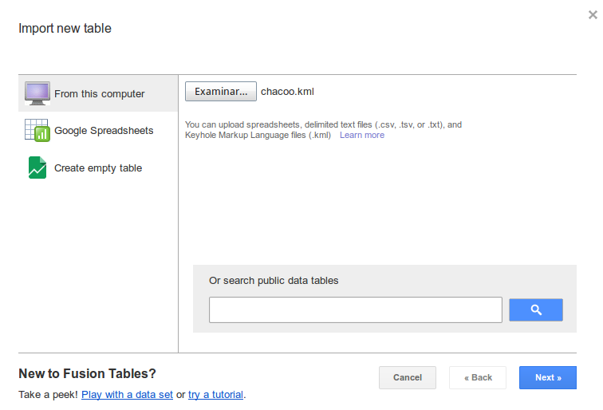

Nos va a mostrar un preview del archivo donde podremos verificar los
nombres de los atributos y el tipo de geometría que estamos subiendo.
Luego, Next.

        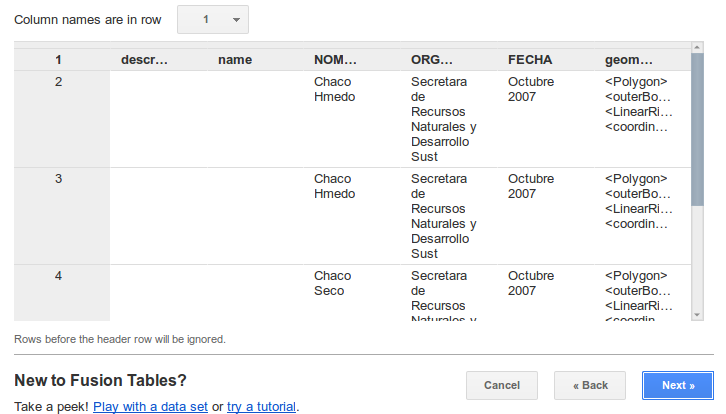

En esta sección podremos editar algunos parámetros de la nueva tabla
como el nombre, la descripción y algunos permisos básicos. Damos clic en
Finish.

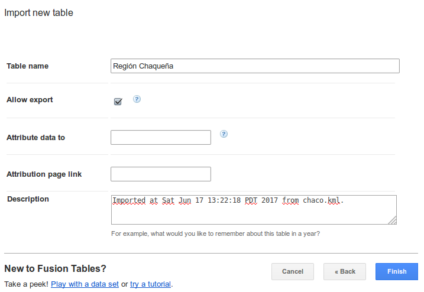

Ahora si ya está disponible la nueva tabla. Si vamos a la solapa Map of
geometry podemos ver desplegada sobre un mapa de Google la columna
geometría que se subió con el archivo kml.

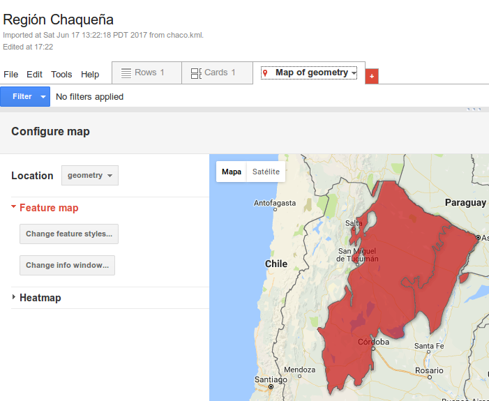

En la opción Share se puede ajustar las opción de seguridad de la nueva
capa que fue subida al GFT.

Para poder importar este archivo a GEE necesitamos el ID de la tabla,
para ello vamos a File y seleccionamos About this table. Ahí
encontraremos el identificador (Id).

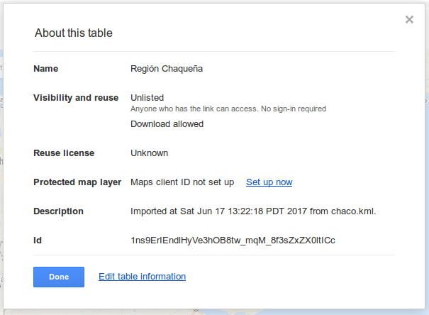

También en la opción “Enlace para compartir” disponible en Share,
tenemos disponible el identificador de la GFT a través del cual vamos a
vincular la tabla con nuestro script.

        

                        

Crear un FeatureCollection desde GFT

Para cargar una FeatureCollection desde una Fusion Table, proporcione al
constructor (ee.FeatureCollection) el ID de tabla agregado a ft:. Por
ejemplo:

var desdeFT =

ee.FeatureCollection('ft:1ns9ErIEndlHyVe3hOB8tw\_mqM\_8f3sZxZX0ltICc');

print(desdeFT);

Map.addLayer(desdeFT, {}, 'Región Chaqueña');

Map.centerObject(desdeFT);

3.  Creación de un FeatureCollection a partir de Tablas

Es posible instanciar un FC utilizando tablas que tenemos almacenadas en
un Assets. Para crear esta nueva tabla podemos utilizar un Shapefile o
un .zip que contenga todos los archivos que componen el Shapefile. El
tamaño máximo permitido es 10GB.

+--------------------------------------+--------------------------------------+
| Los pasos para subir un Shapefile    | 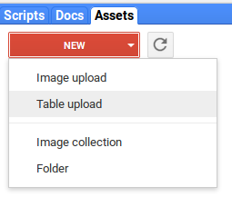              |
| son seleccionar desde Assets NEW \>  |                                      |
| Table Upload.                        |                                      |
+--------------------------------------+--------------------------------------+

+--------------------------------------+--------------------------------------+
| Luego seleccionamos desde nuestro    |                |
| sistema de archivo el shapefile y    |                                      |
| todos los archivos que lo componen   |                                      |
| (podemos seleccionar el .zip         |                                      |
| también).                            |                                      |
+--------------------------------------+--------------------------------------+

+--------------------------------------+--------------------------------------+
| Por default toma el nombre del shp   | 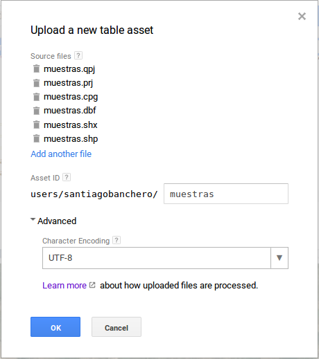               |
| para la tabla pero se puede editar.  |                                      |
|                                      |                                      |
|                                      |                                      |
|                                      |                                      |
| Además, podemos indicar la           |                                      |
| codificación de caracteres que posee |                                      |
| el shp para no encontrarnos luego    |                                      |
| con caracteres mal interpretados.    |                                      |
| Esta opción está en Advanced.        |                                      |
|                                      |                                      |
| Ok para finalizar.                   |                                      |
+--------------------------------------+--------------------------------------+

El upload no es instantáneo y puede demorar algunos minutos dependiendo
de la congestión de la plataforma y el tamaño que tenga el archivo.
Podemos verificar el progreso desde la solapa TASK:

+--------------------------------------+--------------------------------------+
| Tarea en proceso.                    |               |
+--------------------------------------+--------------------------------------+
| Tarea finalizada.                    |                |
+--------------------------------------+--------------------------------------+

+--------------------------------------+--------------------------------------+
| Finalizada la carga la Tabla estará  | 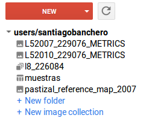              |
| disponible en el Assets de nuestro   |                                      |
| usuario.                             |                                      |
+--------------------------------------+--------------------------------------+

var txt\_assets = 'users/\<usuario\>/muestras';

var muestreos = ee.FeatureCollection(txt\_assets);

print(muestreos);

Map.addLayer(muestreos, {}, 'Muestras');

        

4.  Es posible crear un FeatureCollection a partir de generar una
    muestra al azar de puntos dada una región.

        var region =

ee.Geometry.Rectangle(-63.457, -25.155, -62.699, -24.714);

var randomPoints =
[ee.FeatureCollection.randomPoints](https://developers.google.com/earth-engine/api_docs%23eefeaturecollectionrandompoints&sa=D&ust=1500416741628000&usg=AFQjCNH5uXf6r6NRCHA4aC-SOc9nTiCaZw)(

region,

100, // cantidad de puntos

123); // seed

print(randomPoints)

Map.centerObject(randomPoints);

Map.addLayer(randomPoints, {}, 'Puntos al azar');

5.  Creación de FeaturesCollection desde el Mapa

Al igual que mostramos anteriormente como dibujar geometrías, es posible
definir FeaturesCollection dibujando desde el mapa.

        

En la configuración podemos darle un nombre al Layer y agregar
propiedades con valores por defecto y definir el color.

                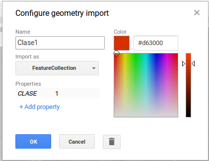

        

        

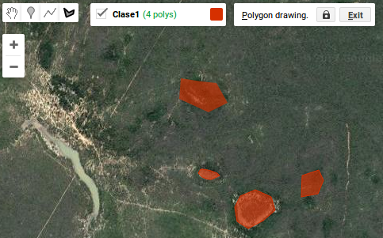

Podemos incorporar esto FeaturesCollection desde la sección de Imports.

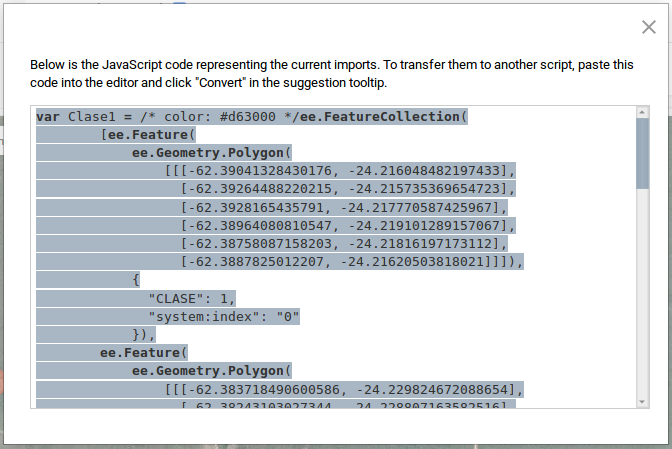

Operaciones Básicas sobre FeaturesCollection {#h.wy02xu8jk1z .c41}
============================================

Existen varios métodos para recuperar información y metadatos de un FC.

var key = 'ft:1ExULsxnCc7x8AJQmD7bsg9iQKrKMVbkbOJi62XVy';

var muestreos = ee.FeatureCollection(key);

Map.addLayer(muestreos, {}, 'Áreas muestreadas');

Map.centerObject(muestreos);

print(muestreos.limit(1)); // Limitamos el \# de features

print('Lista de atributos:',muestreos.first().propertyNames()); //
Listar los atributos del primer feature

print('Cantidad: ', muestreos.size()); // \# de features en la colección

Operaciones de agregación por columnas.

// Contar cuántas instancias de cada clase hay

print('Clases Distintas:',

 muestreos.aggregate\_count\_distinct('class'));

// Suma toda la columna area\_ha

print('Superficie Total (Ha):',

         muestreos.aggregate\_sum('area\_ha'));

 

### Desafío 4 

Calcule el tamaño promedio de las parcelas muestreadas.

Construcción de Filtros
=======================

var key = 'ft:1ExULsxnCc7x8AJQmD7bsg9iQKrKMVbkbOJi62XVy';

var muestreos = ee.FeatureCollection(key);

Map.addLayer(muestreos, {}, 'Áreas muestreadas');

var limites = ee.Geometry.Rectangle(

[-60.501708984375,

 -26.754194629270284,

 -60.373992919921875,

 -26.84051574561839]);

 

var filtrados = muestreos.filterBounds(limites);

print('Cantidad de features después de filtrar:', filtrados.size());

 

Map.addLayer(filtrados, {color: '1ae008'}, 'Filtrados por región');

var filtradasXarea =
filtrados.filter([ee.Filter.gt](https://developers.google.com/earth-engine/api_docs%23eefiltergt&sa=D&ust=1500416741636000&usg=AFQjCNGnKyLieX0jTnktMF1-2_wALOkmRQ)('area\_ha',
10));

print('Parcelas de más de 10 ha:', filtradasXarea.size());

Map.addLayer(filtradasXarea, {color: 'f4df42'}, 'Más de 10  ha');

### Desafío 5 {#h.mhq9fym1yean .c32}

Construya un filtro que permita filtrar las clases de tipo 131.

### Desafío 6 {#h.6epghz33o2hn .c32}

¿Cuántas parcelas fueron etiquetadas como ARBUSTAL en la descripción?

Operador Selection {#h.k5vwvhdz18jn .c41}
==================

Selección de propiedades de un Feature para generar un nuevo
FeatureCollection.

var fc\_seleccion = filtrados.select(

['area\_ha', 'class'],

['AREA','CLASE']);

print(fc\_seleccion);

Manejo de  iteraciones sobre colecciones de features. {#h.ifc34hw823ya .c41}
=====================================================

Existen varias opciones para poder iterar sobre un FeatureCollection,
una forma simple de modificar cada uno de los Features de un
FeatureCollection es utilizando la instrucción
[ee.FeatureCollection.map](https://developers.google.com/earth-engine/api_docs%23eefeaturecollectionmap&sa=D&ust=1500416741638000&usg=AFQjCNEOOIoHesk17rSOuyMXY4TIuQNrMw).
Esta instrucción permite recorrer cada Feature y generar un
FeatureCollection nuevo.

Veamos un ejemplo simple, supongamos que queremos incorporar al
FeatureCollection de las muestras un atributo que sea perímetro. Esto
requiere que para cada elemento (de tipo Feature) de la colección
hagamos el cálculo, eso sería:

var get\_perimetro = function(elemento){

        return elemento.set(

{perimetro: elemento.geometry().perimeter()}

);

}

var m\_con\_perimetro = muestreos.map(get\_perimetro);

print(m\_con\_perimetro);

Otro ejemplo de map, supongamos que tenemos un CSV con las coordenadas
expresadas en grados decimales y queremos generar la geometría para cada
Feature del FeatureCollection:

var key = 'ft:1t-2SIDNQHZji\_6iSWww0pAbd\_4i33l8o68NUh4an';

var muestreos = ee.FeatureCollection(key);

// Muestreo sin geometría

print( muestreos.limit(1) );

 

var agregar\_geometria = function( elemento ){

   

var geom = ee.Geometry.Point([

                elemento.get('longitud'),

               elemento.get('latitud')]);

           

        return elemento.setGeometry(geom);

  };

Map.addLayer( muestreos.map(agregar\_geometria), {}, 'Muestras');

### Desafío 7 {#h.b8c1hlkra51j .c57}

Escriba una función de mapeo que para valores de class entre 20 y 23
completen un nuevo atributo llamado TIPO con el valor “Bosque” y en caso
contrario complete con “No Bosque”.

Existe otra forma de recorrer un FeatureCollection que es con el método
iterate.

var key = 'ft:1ExULsxnCc7x8AJQmD7bsg9iQKrKMVbkbOJi62XVy';

var muestreos = ee.FeatureCollection(key);

var n\_dict = ee.Dictionary({});

var n\_class = muestreos.distinct(['class']).iterate(

function(feat, n\_dict){

  return ee.Dictionary(n\_dict).set(

        feat.get('class'),

        muestreos.filter(

          ee.Filter.eq('class', feat.get('class')))

.aggregate\_count('class')

        );

}, n\_dict);

print(n\_class);

Exportar como tabla de datos. {#h.jwtjm01c5qaq .c41}
=============================

Para exportar un FeatureCollection a Google Drive se requiere la
instrucción Export.table.toDrive()

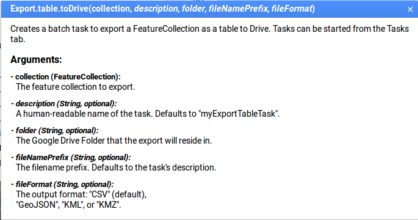

KML

Export.table.toDrive({

          collection: \<Nombre del FC\>,

          description:'Una descripción de la capa para encontrarlo en
Drive',

          fileFormat: 'KML o KMZ'

});

CSV

Export.table.toDrive({

          collection: \<Nombre del FC\>,

          description:'Una descripción de la tabla para encontrarla en
Drive',

          fileFormat: 'CSV'

});

Ejemplo:

var key = 'ft:1t-2SIDNQHZji\_6iSWww0pAbd\_4i33l8o68NUh4an';

var muestreos = ee.FeatureCollection(key);

var mapear\_clase = function( elemento ){

return elemento.set('tipo',

ee.Algorithms.If(
ee.Number(elemento.get('class')).gte(20).and(ee.Number(elemento.get('class')).lte(23))
 ,

          'Bosque',

          'No Bosque'));

};

var fc\_tipo = muestreos.map( mapear\_clase );

// Exportar a CSV

Export.table.toDrive({

collection: fc\_tipo,

description: 'TablaBosqueNoBosque', //Es el nombre que tendrá el archivo

fileFormat: 'CSV'

});

Luego de exportar se incluirá una nueva tarea que hay que poner a
correr.

Dependiendo de la cantidad de features en la colección el proceso puede
demorar mucho o poco y además también dependerá de la carga de trabajo
de la plataforma.

Realizar gráficos. {#h.5z2q7tivh7s7 .c41}
==================

En GEE es posible realizar diferentes tipos de gráficos utilizando la
librería ui.Chart. Las opciones disponibles para FeaturesCollection son:

-   ui.Chart.feature.byFeature(features, xProperty, yProperties)
-   ui.Chart.feature.byProperty(features, xProperties, seriesProperty)
-   ui.Chart.feature.groups(features, xProperty, yProperty,
    seriesProperty)
-   ui.Chart.feature.histogram(features, property, maxBuckets,
    minBucketWidth, maxRaw)

Ejemplos:

Graficar Features por Histogramas

var key = 'ft:1ExULsxnCc7x8AJQmD7bsg9iQKrKMVbkbOJi62XVy';

var muestreos = ee.FeatureCollection(key);

 

var histograma = ui.Chart.feature.histogram(muestreos, 'area\_ha', 5);

print(histograma);

Graficar Features por Grupos

var key = 'ft:1ExULsxnCc7x8AJQmD7bsg9iQKrKMVbkbOJi62XVy';

var muestreos = ee.FeatureCollection(key);

// Agrego el perímetro

var get\_perimetro = function(elemento){

return elemento.set({perimetro: elemento.geometry().perimeter()});

}

var m\_con\_perimetro = muestreos.map(get\_perimetro);

// Agrego el tipo Bosque / No Bosque

var mapear\_clase = function( elemento ){

return elemento.set('tipo',

ee.Algorithms.If(
ee.Number(elemento.get('class')).gte(20).and(ee.Number(elemento.get('class')).lte(23))
 ,

          'Bosque',

          'No Bosque'));

};

var fc\_tipo = m\_con\_perimetro.map( mapear\_clase );

var chart = ui.Chart.feature.groups(fc\_tipo, 'area\_ha', 'perimetro',
'tipo')

.setChartType('ScatterChart')

.setOptions({

  hAxis: {title: 'Area (Ha)'},

  vAxis: {title: 'Perímetro (m)'},

}).setSeriesNames(["Bosque", "No Bosque"]);

print(chart);

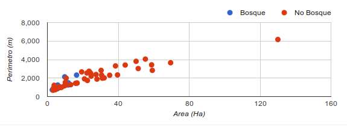

Bibliografía {#h.n9shj7ji2ll .c58}
============

API | Google Earth Engine API.
[https://developers.google.com/earth-engine/api\_docs](https://developers.google.com/earth-engine/api_docs&sa=D&ust=1500416741653000&usg=AFQjCNEGSbERzdNudCWnXjdyiTKrUeLFPQ)

* * * * *

[[1]](#ftnt_ref1) European Petroleum Survey Group
