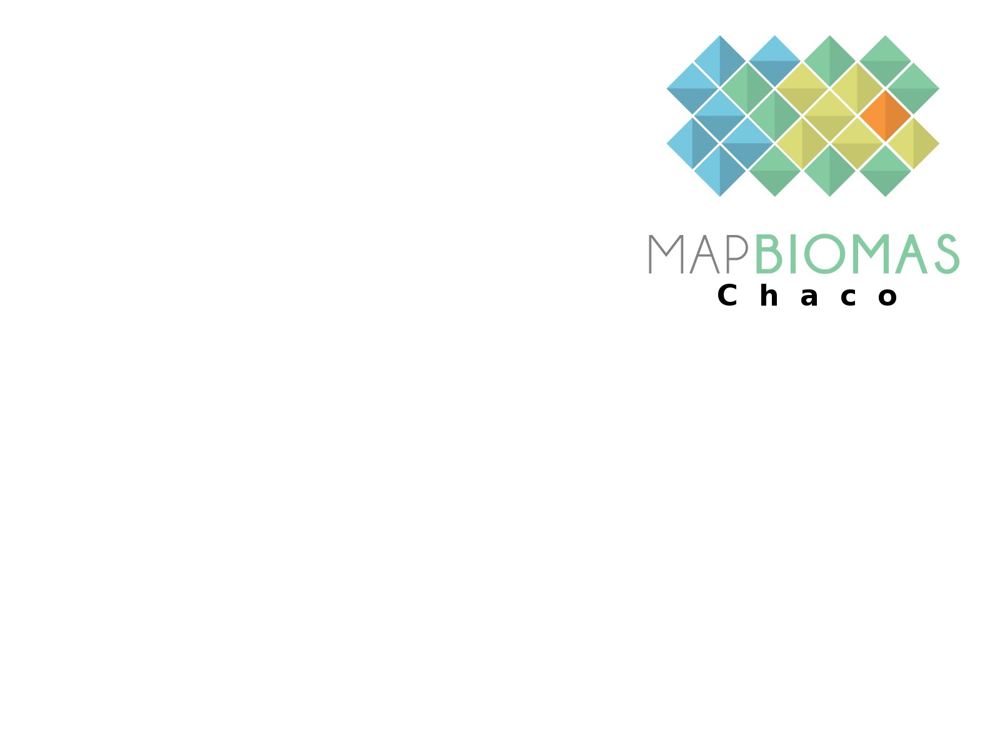
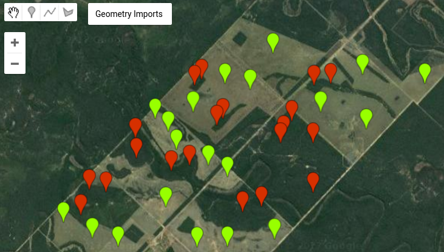
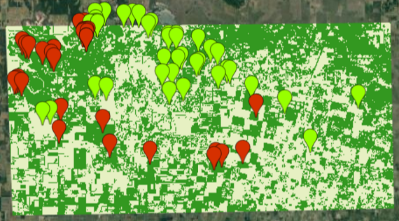

<!-- $theme: default -->
<!-- footer: Taller GEE - MapBiomas - EEA Salta. Noviembre 2017 -->
<!-- page_number: true -->


<br>

Clasificaciones Supervisadas
===

---
# Contenidos
	
Incorporación de datos de campo y generación de datos de entrenamiento desde la interfaz de GE. Cálculo de mosaicos de índices del área de estudio. Muestreo a partir de los datos de campo. Separación en training/testing. Algoritmos disponibles para clasificación supervisada. Parametrización de los algoritmos. Ajustes. Validación utilizando matrices de confusión (accuracy, kappa). Aplicación del modelo y mapeo de resultados. Visualizar y exportar los resultados de  la clasificación.

---

# Preprocesamiento y generación del conjunto de datos

Algunos de los pasos requeridos para una clasificación ya fueron explicados en tutoriales anteriores. 

Estos son:

1.  Cargar vector del área de estudio
2.  Seleccionar colección de imágenes y filtrar por fecha, nubes,
    bandas, etc.
3.  Reducir colección a imágen (e.g. calcular mediana para cada banda).

---
# Definimos el ImageCollection

Esta ya se la saben :D

Son codigos del Tutorial 1 Seccion 2

```javascript
// 1. area de estudio (de sección anterior)
var geometry = ee.FeatureCollection('ft:1NOdzgdcCiWZ6YcoEharXG_IYmW03G-ZJeUSZtoOB');

// 2. Seleccionar colecciones
// Seleccionar producto. Indicar el ImageCollection ID

var producto = ee.ImageCollection('LANDSAT/LC8_L1T_TOA');

// Definir bandas a seleccionar
var bandas = ['B2', 'B3', 'B4', 'B5', 'B6', 'B7'];
```

---
# Aplicamos los filtros

```
// Filtrar colección
var coleccion1 = producto
    // por área de estudio. Debe estar cargada el área en este caso en la variable “geometry”
    .filterBounds(geometry)
    //por rango de fechas
    .filterDate('2016-08-01', '2016-10-31')
    // por cobertura de nubes máxima
    .filterMetadata('CLOUD_COVER','less_than', 40)
    // por bandas (definidas más arriba)
    .select(bandas);

// ver detalles de colección y filtros aplicados
print("Coleccion seleccionada", coleccion1);
```

---
# Hacemos el mosaico
```javascript
// 3. Convertir a Imagen. Aplicar reducción de mediana
var stack1 = coleccion1.median();

// Agregar la imagen al mapa con una configuración de 
// Falso Color

Map.addLayer (stack1, 
	{bands: ['B5', 'B4', 'B3'], 
    	min: [0,0,0], 
        max: [0.6,0.6,0.6] }, 
        "Landsat 8 B5-B4-B3" );

// Centrar en área de estudio
Map.centerObject(geometry, 8);
```

---

# Cargar o generar puntos (o polígonos) de entrenamiento y validación

Para el punto 4 se pueden generar nuevos puntos, cargarlos a partir de un vector disponible previamente u obtenerlos de puntos ya generados en la plataforma GEE.

https://code.earthengine.google.com/ce97d96621040d67a1ec08ffc0df322c




---


Ahora vamos a combinar las dos variables **clase0** y **clase1** en un único FeatureCollection:

```javascript
// Unir muestras por clase en un único FeatureCollection
var samples = clase0.merge( clase1 );

// ver caracteristicas de FeatureCollection
print ("muestras", samples);
```
---

# Clasificaciones Supervisadas

Las clasificaciones supervisadas se realizan cuando se tienen definidas las clases y se dispone  de información de casos correspondientes a esas clases (información de campo). Los distintos clasificadores se entrenan con la información de campo disponible a partir del comportamiento en las distintas bandas consideradas. La evaluación del resultado de una clasificación requiere disponer de datos independientes a los utilizados para el entrenamiento.  

---

# Separación en train/testing

Separación del conjunto de datos para entrenamiento y validación. La plataforma permite generar atributos (llamado “random” en este caso) con números al azar mediante la función randomColumn y agregarlos al FeatureCollection que contiene el set de datos. Genera valores entre 0 y 1. Esta requiere indicar el FeatureCollection y un valor inicial para generar los números al azar (“seed”):

```javascript
// Separacion de set de datos (polígonos) para entrenamiento y validación
// generación de atributo con números al azar (columna "random")
// para hacer muestreo

var seed = 2015;
samples = samples.randomColumn('random', seed);
```
---

Esto nos permitirá hacer un muestreo, seleccionando filas que contengan cierto rango de números generados al azar (Mayores o menores a cierto valor umbral). Para entrenar el algoritmo de clasificación se requiere extraer información de las imágenes para los polígonos seleccionados (similar a la etracción de información visto en secciones anteriores), incluyendo en las salidas los atributos clase y “random”:

```javascript
// extraccion de información incluyendo atributos clase y "random"
var set_datos = stack1.sampleRegions({
  collection: samples,
  properties: ['clase','random'],
  scale: 30
});
```
---

El resultado de la extracción es una FeatureCollection que contiene información de cada banda y cada polígono:


---

Posteriormente se subdivide el FeatureCollection con el set de datos en Entrenamiento (“training”) y Validación (“testing”). Se selecciona un umbral de separación de los valores al azar generados entre 0 y 1 (atributo “random”). En este caso, se seleccionan los valores mayores o iguales a 0.6 para entrenamiento y los menores a 0.6 para validación. Se pueden ver en consola los nuevos set de datos generados:

```javascript
// Separación entre Entrenamiento y validación. Identificar umbral de separación
var training = set_datos.filterMetadata('random', 'not_less_than', 0.6);
var testing = set_datos.filterMetadata('random', 'less_than', 0.6);

print ("Set de datos entrenamiento", training);
print ("Set de datos validación", testing);
```
---

# Entrenamiento

Aquí debemos seleccionar el algoritmo de clasificación, el set de datos de entrenamiento (“training”), el atributo de separación en clases (“clase”) y las bandas seleccionadas. En este caso usamos el algoritmo Random Forest:

```javascript
// Entrenamiento
var bandas_sel = ['B7','B6','B5', 'B4', 'B3'];
var trained = ee.Classifier.randomForest().train(training, 'clase', bandas_sel);
```
---

# Aplicar el modelo

Una vez entrenado el modelo, se lo aplica a una imagen y se genera la clasificación.

```javascript
// clasificación con el modelo entrenado
var classified = stack1.select(bandas)
	.classify(trained)
    	.clip(geometry);
        
Map.addLayer(classified, 
	{min:0, 
         max:1, 
         palette: ['339820', 'e6f0c2']}, 
         'Clasificacion');

print(classified);
```
---
# Exportar la clasificación a Drive

La clasificación puede ser exportada como imagen GeoTiff

```javascript
// Exportar imagen de clasificación
Export.image.toDrive({
  image:classified,
  description: 'clasificacion',
  scale: 30,
  region: geometry
});
```

---

# Evaluación del modelos 

Generación de Matriz de Confusión y resultados. La herramienta permite calcular la matriz de confusión, y estimar exactitud general, de usuario y de productor e indice Kappa.

```javascript
// Generación de matriz de confusión y resultados
var validation = testing.classify(trained);
var errorMatrix = validation.errorMatrix('clase', 'classification');

print('Matriz de Confusión:', errorMatrix);
print('Exactitud General:', errorMatrix.accuracy());
print('Indice Kappa:', errorMatrix.kappa());
print('Exactitudes de Usuario:', errorMatrix.consumersAccuracy());
print('Exactitudes de Productor:', errorMatrix.producersAccuracy());

// exportar matriz de confusion como csv
var err = ee.FeatureCollection( ee.Feature(null, {
  'matrix': errorMatrix.getInfo()
}));
print (err);
```
---

# Exportar la matriz de confusión
```
Export.table.toDrive({
    'collection': err,
    'description': 'CM_tutorial_2',
    'fileNamePrefix': 'CM_tutorial_2',
    'fileFormat': 'CSV'}
);

// convertir matriz de confusion a array
var cfmt2x2 =  errorMatrix.array().toList().map(
  function(item){
        item = ee.List(item);
        return ee.Feature(null, {Bosque: item.get(0), NoBosque: item.get(1)})

  });

print(cfmt2x2);
```
---

# Ejemplo de clase

[Actividad Propuesta](https://code.earthengine.google.com/2d2aa48aabfd3b5a2a6c821a307ea5c0)


Modifique el script para que funcione con CART y almacene el árbol generado en una nueva variable utilizando la función __explain__.

Luego realice una nueva clasificación con el árbol ya generado y utilizando la funcionalidad provista por ee.Classifier.decisionTree en la región cubierta por el siguiente polígono:

```javascript
var nueva_zona = ee.Geometry.Rectangle([-64.456, -24.417, -61.369, -26.214]);
```

1. ¿Qué pasa si incremento el número de árboles de un RandomForest?
2. ¿Qué pasa si limito la profundidad en CART?

--- 
#  Muestreo para la clasificación no supervisada
```javascript
// Seleccionamos los pixeles para correr el agrupamiento
var datos_km = stack1.clip(area_estudio).sample({
    region: area_estudio,
    scale: 30,
    numPixels: 5000,
    seed: 10
  });

```
---
# Configuramos el algoritmo wekaXMeans

```javascript
var TOTALK = 10; // Máxima cantidad de clusters
var clasificadorNoSup = ee.Clusterer.wekaXMeans(
  {minClusters: 2,  // Mínima cantidad de clusters
   maxClusters: TOTALK, 
   maxIterations: 100, 
   distanceFunction: "Euclidean", 
   seed: 123});

// Entreno con las muestras
clasificadorNoSup = clasificadorNoSup.train(datos_km);
```

---

# Ejemplo completo
[Aquí](https://code.earthengine.google.com/fea0d8781a27839d7c3daace74c30bc2) está el ejemplo completo de la clasificación supervisada y no supervisada.
